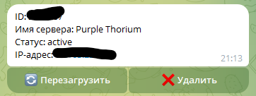
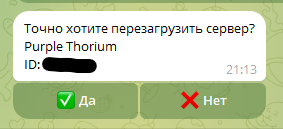
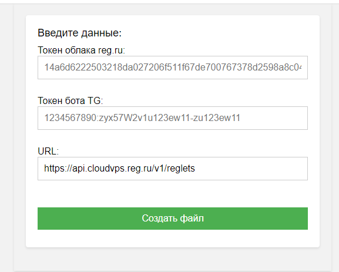
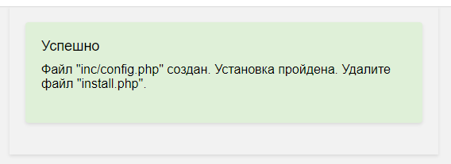
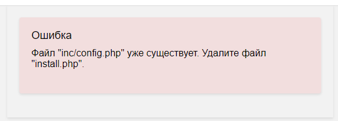

Для работы необходима библиотека [PHP Telegram Bot Api](https://github.com/TelegramBot/Api)

Назначаем webHook используя URL

https://api.telegram.org/bot{BotToken}/setWebhook?url=https://example.ru/index.php

ToDo:
1. Избавиться от файла inc/functions.php (+)
2. Инсталлятор для записи config.php (+)
3. Разбить ServerManager.